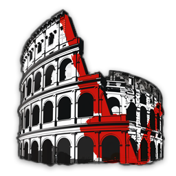

# KindredArenas for V Rising
KindredArenas is a server modification for VRising PvP servers.
Best use is with PvP always on.

Arenas = PvP always enabled in the specified area unless overlapping with an Elysium during PvP time. 

Elysiums = PvP always disabled in the specified area unless overlapping with an Arena not during PvP time. 

PvP time commands are available to set specific times for PvP to be enabled through protection. 
If PvP time is ongoing, all players are not PvP protected except in designated Elysiums.
If PvP time is off schedule, all players are PvP protected except in designated Arenas.

Days must be abbreviated enough to differentiate from each other. (Su, M, Tu, W, Th, F, Sa) 
Each day must be specified, there is no M-F or Su-Sa.

Time must be in 12 hour format with AM or PM. HH:MMam or HH:MMpm

A note about on/off commands: All arenas/elysiums are globally on at server start. If you are globally turning off all arenas/elysiums, that will not persist through server restart. If you are disabling a specific arena/elysium, that will persist through server restart.

---
Also, thanks to the V Rising modding and server communities for ideas and requests!
Feel free to reach out to me on discord (odjit) if you have any questions or need help with the mod.

[V Rising Modding Discord](https://vrisingmods.com/discord)

## Commands
### PvP Time Commands
- `.pvptime add (DaysOfTheWeek) (StartTime) (EndTime)` 
  - turns on or off PvP time
  - Example: *.pvptime add SuMTuWThFSa 8:00am 8:00PM*
	- This allows for PvP time to be on from 8:00AM to 8:00PM every day of the week.
  - Example 2: *.pvptime add Su 8:00AM 8:00PM*
	- This allows for PvP time to be on from 8:00AM to 8:00PM on Sundays.
  - Example 3: *.pvptime add FSaSu 8:00AM 1:00AM*
	- This allows for PvP time to start Friday at 8 am, end 1 am Saturday, start again 8 am saturday, end 1 am Sunday, then finally start 8 am sunday, and end 1 am Monday
- `.pvptime list` 
  - Lists all PvP time entries. The index numbers are beside each entry and the * indicates the current active PvP time.
- `.pvptime remove (index)` 
  - Deletes a PvP time entry
  - Example: *.pvptime remove 1*

### Arena Commands
- `.arena (on/off)`
  - turns on or off all arenas
- `.arena create (Name) (radius)`
  - makes a PvP arena centered at your location with the specified name and radius size
  - Example: *.arena create Test 10*
  - Shortcut: *.arena add*
- `.arena remove (name)`
  - deletes a named arena
  - Example: *.arena remove Test*
  - Shortcut: *.arena delete*
- `.arena list`
  - Lists all PvP arenas with details
- `.arena center (name)`
  - changes the center of a PvP arena to your current position
  - Example: *.arena center Test*
- `.arena radius (name) (radius)`
  - changes the radius of a PvP arena to the amount specified. If the (radius) field is left blank, it will change the radius to the different between the center position and your new current position.
  - Example: *.arena radius Test 10*
  - Example 2: *.arena radius Test* (this one will set the radius edge to your current position)
- `.arena enable (name)`
  - Enables a specified PvP arena
  - Example: *.arena enable Test*
- `.arena disable (name)`
  - Disables a specified PvP arena
  - Example: *.arena disable Test*
- `.arena teleport (name)`
  - Teleports you to the center of the named PvP arena
  - Example: *.arena teleport Test*
  - Shortcut: *.arena tp*
	
### Elysium Commands
- `.elysium (on/off)`
  - turns on or off all safe zones
	- Example: *.elysium on*
- `.elysium create (Name) (radius)`
  - makes a safe zone centered at your location with the specified name and radius size
  - Example: *.elysium create Test 10*
  - Shortcut: *.elysium add*
- `.elysium remove (name)`
  - deletes a named safe zone
  - Example: *.elysium remove Test*
  - Shortcut: *.elysium delete*
- `.elysium list`
  - Lists all safe zones with details
- `.elysium center (name)`
  - changes the center of a safe zone to your current position
  - Example: *.elysium center Test*
- `.elysium radius (name) (radius)`
  - changes the radius of a safe zone to the amount specified. If the (radius) field is left blank, it will change the radius to the different between the center position and your new current position.
  - Example: *.elysium radius Test 10*
  - Example 2: *.elysium radius Test* (this one will set the radius edge to your current position)	
- `.elysium enable (name)`
  - Enables a specified safe zone
  - Example: *.elysium enable Test*
- `.elysium disable (name)`
  - Disables a specified safe zone
  - Example: *.elysium disable Test*
- `.elysium teleport (name)`
  - Teleports you to the center of the named safe zone
  - Example: *.elysium teleport Test*
  - Shortcut: *.elysium tp*
  
  
## Eventual To-Do/Possible features
- make non-circle shaped arenas/elysiums
- maybe add a height component to the arenas/elysiums so only certain floors are arenas/elysiums. 